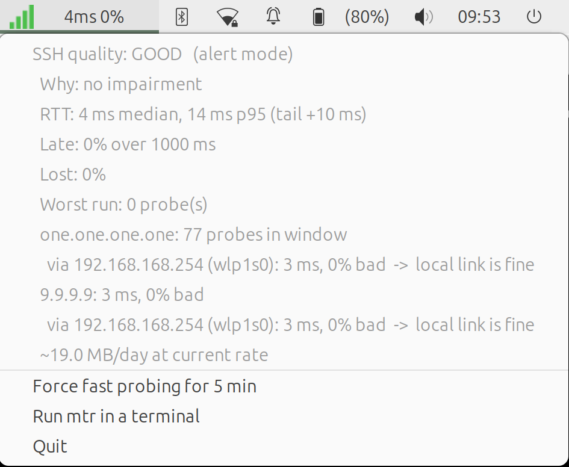

# netquality

netquality is a system tray indicator. It grades a network link by one question:
is the link good enough for the work you do? It does not measure throughput.

Select a profile. `ssh` is the default. Use `realtime` for voice and video. Use
`web` for a browser. The profile sets the limits and the words together. A steady
200 ms link is good for the web, fair for SSH, and poor for a call.



netquality puts each probe in one of three classes. The classes are `OK`, `LATE`
and `LOST`. A reply that comes after 13 seconds is a dead session. It is not a
delivered packet.

netquality also counts the longest run of bad probes in sequence. A frozen session
and scattered loss can have the same loss rate. The run length tells them apart.

The probe rate changes with the conditions. The rate is slow when the link is
good. The rate increases when the link becomes unstable. Idle cost is
approximately 1.9 MB each day, so you can use netquality on metered mobile data.

## Install

Download the `.deb` file from
[Releases](https://github.com/z-image/netquality/releases). Then install it:

```
sudo apt install ./netquality_0.1.3_all.deb
```

## Usage

```
netquality --target your.ssh.host
```

Set `--target` to a host that you use. A public resolver can be good when your
own destination is bad.

### More than one target

You can give `--target` more than one time.

The FIRST target sets the icon and the grade. netquality probes the other targets
only during an alert. Thus more targets do not increase the cost when the link is
good. More than one target answers a question that one target cannot: is one
destination bad, or is all traffic bad?

When the link is good, the menu shows each other target as "standby, probed only
during an alert".

netquality also probes the first hop to each target. The first hop shows if a
fault is on your own link or after it. Together, the targets and the hops separate
three faults that look the same from your machine: your link, the path, and the
destination.

```
netquality --target work.example.com --target 203.0.113.9
```

The menu during an alert:

```
  work.example.com: 54 probes in window
    via 10.8.0.1 (tun0): reached through this tunnel, silent to ICMP
  203.0.113.9: 51 ms, 2% bad
    via 192.168.1.1 (wlp1s0): 4 ms, 0% bad  ->  local link is fine
```

This example shows a VPN. netquality reaches the first target through a tunnel.
The second target is the VPN server. The first target is 54 ms and the second
target is 51 ms, thus the tunnel adds almost no delay. The first hop is 4 ms, thus
your own link is good. The delay is the distance to the server.

You do not configure a VPN. A tunnel is only a first hop that goes out through a
tunnel device.

netquality probes each address one time. If more than one target has the same
first hop, netquality does not probe that hop two times.

### Profiles

| `--profile` | Use for | Deadline | Median fair/poor/bad | Bad % poor/bad |
|---|---|---|---|---|
| `ssh` (default) | typed commands | 1000 ms | 120 / 300 / 600 ms | 8 / 20 |
| `realtime` | voice, video, games | 250 ms | 80 / 150 / 300 ms | 2 / 5 |
| `web` | browser, downloads | 3000 ms | 250 / 600 / 1200 ms | 15 / 30 |

A profile sets the words and the limits together. A limit that you give on the
command line replaces the limit from the profile.

There is no profile for throughput. ICMP round-trip time cannot measure bandwidth.
A profile for throughput would give a false result.

netquality sends a probe every 5 seconds when the link is good. This rate finds
loss, freezes and delay peaks. This rate is too slow to measure the jitter between
the packets in a call. The `realtime` profile makes the limits tighter. It does
not make netquality a VoIP analyser.

### Metered links

The idle cost is approximately 1.9 MB each day. The cost increases only when the
link is bad.

To decrease the idle cost to approximately 0.5 MB each day:

```
netquality --calm-interval 15 --no-hops
```

If freezes of less than one second are a problem when you type, use
`--deadline 500`.

For all the limits, refer to `netquality --help`.

netquality needs an AppIndicator host. On MATE, add the **Indicator Applet
Complete** to the panel. The Notification Area applet does not show netquality.

## Why not use ping?

The menu gives the name of the rule that set the colour. Thus the colour is always
clear:

```
SSH quality: BAD   (alert mode)
  Why: 8 bad in a row, 50% unusable, p95 11582 ms, 12% duplicates
  RTT: 115 ms median, 11582 ms p95 (tail +11467 ms)
  Late: 19% over 1000 ms
  Lost: 31%
  Worst run: 8 probe(s),  2 dup
  8.8.8.8: 16 probes in window
    via 192.168.42.129 (usb0): 3 ms, 0% bad  ->  local link is fine
  ~19.0 MB/day at current rate
```

Look at the median. It is 115 ms, which looks like a good link. But half of the
probes were unusable. This is why netquality does not grade on an average.

## Tests

```
python3 tests/test_netquality.py
```

## Design notes

The design notes give the reasons for each measurement, and the traps that were
found during development. Refer to [docs/DESIGN-NOTES.md](docs/DESIGN-NOTES.md).

## Licence

GPL-3.0-or-later. Refer to [LICENSE](LICENSE).
